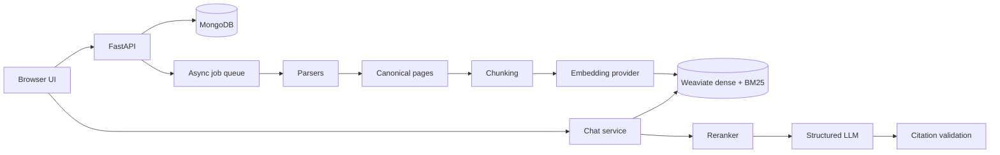

# doc-process-rag

Document Intelligence / RAG platform with asynchronous ingestion, canonical pages, structure-aware chunks, provider abstractions, hybrid Weaviate retrieval, reranking, grounded structured answers, and source citations.

## Architecture



MongoDB is authoritative for documents, pages, chunks, jobs, conversations, and messages. Weaviate is authoritative for searchable vectors. A document is queryable only after parsing, chunking, embedding, and indexing succeed and its persisted state is `READY`.

## Local setup

1. Copy `.env.example` to `.env` and configure provider keys.
2. Start infrastructure with `docker compose up mongodb redis weaviate`.
3. Install dependencies: `python -m pip install -r backend/requirements.txt`.
4. Start the API from `backend`: `uvicorn app.main:app --reload`.
5. Open `frontend/index.html` or serve `frontend` with a static server.

The development UI uses a fixed development tenant/user. Authentication and membership resolution are documented as a remaining limitation below.

## API

- `POST /ingest/create` accepts PDF, Markdown, or HTTP(S) URL sources and returns `202` with a job ID.
- `GET /ingest/{job_id}` reports ingestion and authoritative document readiness.
- `POST /chat/conversations` creates a scoped conversation.
- `GET /chat/conversations` lists development conversations.
- `GET /chat/conversations/{conversation_id}` retrieves metadata.
- `GET /chat/conversations/{conversation_id}/messages` retrieves messages.
- `POST /chat/conversations/{conversation_id}/messages` retrieves, reranks, grounds, validates, and persists an answer.
- `GET /health` and `GET /version` expose service status and application version.

The chat endpoint rejects non-`READY` documents with `DOCUMENT_NOT_READY`. Empty or low-scoring evidence produces `INSUFFICIENT_EVIDENCE`, and generated citations must match retrieved chunks.

## Configuration

Model names and providers are configured through `.env`: `LLM_MODEL`, `EMBEDDING_MODEL`, `RERANKER_MODEL`, retrieval limits, `HYBRID_ALPHA`, chunking limits, and provider API keys. Prompt policy is versioned in `prompts/grounded_answer_v1.yaml`.

## Data model

MongoDB collections include `documents`, `document_pages`, `chunks`, `ingestion_jobs`, `chunking_jobs`, `conversations`, and `messages`. Retrieval-sensitive records carry `tenant_id`. Chunks retain page, heading, block, version, token count, and deterministic content hash metadata.

Each Weaviate object contains `chunk_id`, `document_id`, `tenant_id`, `text`, `document_name`, `page_number`, `heading_path`, `chunking_version`, `content_hash`, and `embedding_model`. Hybrid alpha and retrieval limits are configuration values.

## Tests

```powershell
Set-Location backend
python -m pytest -q
```

The current suite covers parsers, canonical ingestion contracts, token-aware chunking, provenance, and API validation. Provider calls should be covered with mocked HTTP responses in deployment-specific integration tests.

## Known limitations

- The repository still uses an in-process queue rather than Celery, so jobs are lost when the API process stops.
- Authentication and workspace membership are not yet implemented; the current API uses a development tenant/user and must not be deployed publicly.
- Weaviate collection creation and Redis caching are integration work still required before production deployment.
- SSE token streaming, Ragas evaluation, S3-compatible storage, and complete SSRF network policy are not yet implemented.
- Local Weaviate runs anonymously; production deployments must use authentication and TLS.
