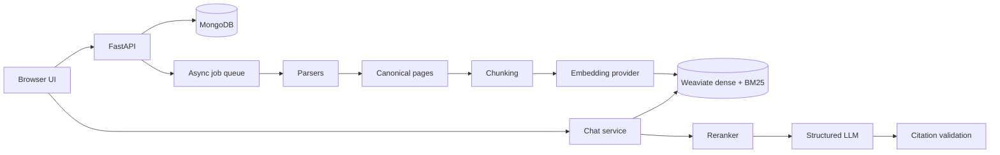

# doc-process-rag

Document Intelligence / RAG platform with asynchronous ingestion, canonical pages, structure-aware chunks, provider abstractions, hybrid Weaviate retrieval, reranking, grounded structured answers, and source citations.

## Architecture



MongoDB is authoritative for documents, pages, chunks, jobs, conversations, and messages. Weaviate is authoritative for searchable vectors. A document is queryable only after parsing, chunking, embedding, and indexing succeed and its persisted state is `READY`.

## Run locally on Windows

The following steps run the complete local application: MongoDB, Redis, Weaviate, FastAPI, and the browser UI. Docker Desktop is required for Weaviate.

### 1. Prerequisites

Install Docker Desktop with the Linux container engine enabled, Python 3.10 or newer, and Git. Start Docker Desktop and wait until its engine is running.

### 2. Create the environment file

From the repository root:

```powershell
Copy-Item .env.example .env
```

Open `.env` and set these values:

```env
MONGODB_URI=mongodb://localhost:27017/
MONGODB_DATABASE=doc_process_rag
WEAVIATE_URL=http://127.0.0.1:8081
EMBEDDING_API_KEY=your_openai_api_key
LLM_API_KEY=your_openai_api_key
RERANKER_API_KEY=your_cohere_api_key
```

The default economical models are `text-embedding-3-small`, `gpt-4o-mini`, and `rerank-v3.5`. Never commit `.env` or expose API keys in logs, screenshots, or source control. Revoke and replace any exposed key.

### 3. Start infrastructure

Weaviate is mapped to port `8081` because port `8080` is commonly used by another local web server:

```powershell
docker compose up -d mongodb redis weaviate
docker compose ps
Invoke-WebRequest http://127.0.0.1:8081/v1/meta
```

The first backend startup creates the Weaviate `RetrievalChunk` collection automatically.

### 4. Create the Python environment

From the repository root:

```powershell
python -m venv .venv
.\.venv\Scripts\Activate.ps1
python -m pip install -r backend\requirements.txt
```

If PowerShell blocks activation, use the interpreter directly:

```powershell
.\.venv\Scripts\python.exe -m pip install -r backend\requirements.txt
```

### 5. Start the backend

Run this from the repository root:

```powershell
.\.venv\Scripts\python.exe -m uvicorn app.main:app `
  --app-dir .\backend `
  --host 127.0.0.1 `
  --port 8000
```

Verify it:

```powershell
Invoke-RestMethod http://127.0.0.1:8000/health
```

Expected response:

```json
{"status":"ok"}
```

Do not start a second backend on port `8000`. If that port is occupied, check the health endpoint first.

### 6. Start the frontend

Open a second PowerShell terminal from the repository root:

```powershell
Set-Location frontend
python -m http.server 5173
```

Open `http://127.0.0.1:5173`. The frontend calls the backend configured in `frontend/config.js`, currently `http://127.0.0.1:8000`.

### 7. Use the application

1. Upload a `.pdf`, `.md`, or `.markdown` file, or add an HTTP/HTTPS URL.
2. Wait until the document status is `READY`.
3. Select the ready document using its checkbox.
4. Ask a question in the chat panel.
5. Inspect the returned citation and supporting excerpt.

The processing lifecycle is:

```text
QUEUED -> PARSING -> CHUNKING -> EMBEDDING -> INDEXING -> READY
```

If a document fails after ingestion, retry downstream processing without uploading it again:

```powershell
Invoke-RestMethod -Method Post `
  http://127.0.0.1:8000/ingest/<job_id>/retry
```

### 8. Test the API directly

Create a conversation for a ready document:

```powershell
$conversation = Invoke-RestMethod -Method Post `
  http://127.0.0.1:8000/chat/conversations `
  -ContentType 'application/json' `
  -Body '{"document_ids":["<document_id>"]}'
```

Ask a question:

```powershell
$body = '{"content":"What skills are listed?","document_ids":["<document_id>"]}'
Invoke-RestMethod -Method Post `
  http://127.0.0.1:8000/chat/conversations/<conversation_id>/messages `
  -ContentType 'application/json' `
  -Body $body
```

The answer includes the model name and citations. A document is queryable only when `"ready_for_ai": true` and `"document_status": "READY"`.

### 9. Run tests

From the repository root:

```powershell
.\.venv\Scripts\python.exe -m pytest -q
```

### Troubleshooting

**Port 8000 is already in use**

```powershell
Invoke-RestMethod http://127.0.0.1:8000/health
Get-NetTCPConnection -LocalPort 8000 -State Listen
```

**Weaviate is unavailable**

```powershell
docker compose up -d weaviate
Invoke-WebRequest http://127.0.0.1:8081/v1/meta
```

**Embedding or reranking fails**

Check that `EMBEDDING_API_KEY` and `RERANKER_API_KEY` are set, that the provider accounts have credits, and restart the backend after editing `.env`.

**The browser shows an old UI**

Use `Ctrl+F5` to force-refresh the frontend.

## API

- `POST /ingest/create` accepts PDF, Markdown, or HTTP(S) URL sources and returns `202` with a job ID.
- `GET /ingest/{job_id}` reports ingestion and authoritative document readiness.
- `POST /chat/conversations` creates a scoped conversation.
- `GET /chat/conversations` lists development conversations.
- `GET /chat/conversations/{conversation_id}` retrieves metadata.
- `GET /chat/conversations/{conversation_id}/messages` retrieves messages.
- `POST /chat/conversations/{conversation_id}/messages` retrieves, reranks, grounds, validates, and persists an answer.
- `GET /health` and `GET /version` expose service status and application version.

The chat endpoint rejects non-`READY` documents with `DOCUMENT_NOT_READY`. Empty or low-scoring evidence produces `INSUFFICIENT_EVIDENCE`, and generated citations must match retrieved chunks.

## Configuration

Model names and providers are configured through `.env`: `LLM_MODEL`, `EMBEDDING_MODEL`, `RERANKER_MODEL`, retrieval limits, `HYBRID_ALPHA`, chunking limits, and provider API keys. Prompt policy is versioned in `prompts/grounded_answer_v1.yaml`.

## Data model

MongoDB collections include `documents`, `document_pages`, `chunks`, `ingestion_jobs`, `chunking_jobs`, `conversations`, and `messages`. Retrieval-sensitive records carry `tenant_id`. Chunks retain page, heading, block, version, token count, and deterministic content hash metadata.

Each Weaviate object contains `chunk_id`, `document_id`, `tenant_id`, `text`, `document_name`, `page_number`, `heading_path`, `chunking_version`, `content_hash`, and `embedding_model`. Hybrid alpha and retrieval limits are configuration values.

## Tests

```powershell
Set-Location backend
python -m pytest -q
```

The current suite covers parsers, canonical ingestion contracts, token-aware chunking, provenance, and API validation. Provider calls should be covered with mocked HTTP responses in deployment-specific integration tests.

## Known limitations

- The repository still uses an in-process queue rather than Celery, so jobs are lost when the API process stops.
- Authentication and workspace membership are not yet implemented; the current API uses a development tenant/user and must not be deployed publicly.
- The local Weaviate collection is created automatically at backend startup; Redis caching is configured but not yet used as a retrieval/readiness cache.
- SSE token streaming, Ragas evaluation, S3-compatible storage, and complete SSRF network policy are not yet implemented.
- Local Weaviate runs anonymously; production deployments must use authentication and TLS.
