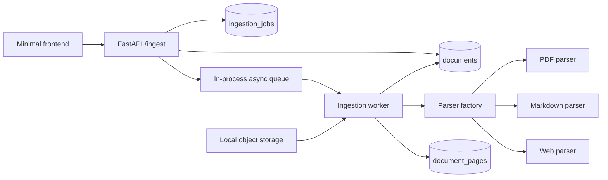
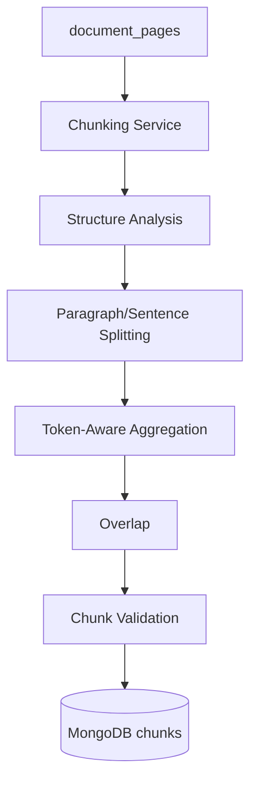

# doc-process-rag

Sprint 1 of a production-oriented document ingestion system. The application accepts PDF files, Markdown files, and web URLs, parses them into one canonical representation, and stores the result in MongoDB for Sprint 2 chunking.

## Scope

Included: FastAPI ingestion API, asynchronous job tracking, PDF/Markdown/web parsers, canonical pages and content blocks, MongoDB persistence, local object storage, retry boundaries, indexes, tests, and a minimal browser UI.

Not included: embeddings, vector databases, BM25, hybrid retrieval, re-ranking, LLM answers, Ragas, evaluation gates, OCR, or chat generation.

## Architecture



This is a modular monolith plus an asynchronous worker, not a microservice architecture. It keeps deployment and local learning simple while preserving interfaces around storage, repositories, parsers, and the queue so those pieces can later move to S3/R2, a managed queue, or separate processes.

## Responsibilities

- `api`: validates HTTP input and returns `202 Accepted`; it never parses a document.
- `services/ingestion.py`: creates documents/jobs, coordinates parsing, persists pages, and applies lifecycle transitions.
- `services/parsers`: format-specific parsing behind one `DocumentParser` protocol.
- `repositories`: the only MongoDB data-access layer.
- `storage`: original binary storage behind `ObjectStorage`; Sprint 1 uses the local filesystem.
- `workers`: consumes job IDs from an in-process queue. Run a separate worker process with a stronger queue in a later deployment.

## Data model

MongoDB has three collections:

- `documents`: logical source identity, tenant, source metadata, lifecycle status, and content statistics.
- `ingestion_jobs`: each processing operation, attempt count, timestamps, and controlled error details.
- `document_pages`: canonical parsed pages. Each page contains `ContentBlock` records such as `heading`, `paragraph`, and `list_item`, plus `plain_text` and metadata.

Original file bytes are stored under `LOCAL_STORAGE_DIR/documents/<document_id>/...`; MongoDB stores only the `storage_key`. This prevents the logical document record from becoming a binary blob and leaves room for object storage later.

The default development tenant is configured by `DEFAULT_TENANT_ID`. Authentication is intentionally outside Sprint 1; this is a controlled development tenancy, not a fake auth system.

## API

Start the API from `backend`:

```powershell
uvicorn app.main:app --reload
```

Create a file job:

```powershell
curl -F "source_type=file" -F "file=@employee_handbook.pdf" http://localhost:8000/ingest/create
```

Create a URL job:

```powershell
curl -F "source_type=url" -F "url=https://example.com/article" http://localhost:8000/ingest/create
```

Poll a job:

```powershell
curl http://localhost:8000/ingest/job_<id>
```

Responses include `document_id`, `job_id`, `status`, timestamps, and controlled error information. Supported statuses are `QUEUED`, `PROCESSING`, `COMPLETED`, `FAILED`, and `CANCELLED`.

## Local setup

1. Start MongoDB locally.
2. Copy `.env.example` to `.env` and adjust values.
3. Install backend dependencies: `python -m pip install -r backend/requirements.txt`.
4. Run the API from `backend` with `uvicorn app.main:app --reload`.
5. Open `frontend/index.html` in a browser, or serve `frontend` with any static file server.

The current queue is intentionally in-process for Sprint 1. It is asynchronous and keeps requests fast, but jobs are lost if the API process stops. A production deployment should replace `JobQueue` with a durable queue and run `IngestionWorker` as a separate worker process.

## Tests

From `backend`:

```powershell
python -m pytest -q
```

Parser tests mock external HTTP and do not require a live website. Repository integration tests against MongoDB can be added when a test MongoDB service is available.

## Current limitations

- No OCR for scanned PDFs.
- Web fetching has timeout and protocol validation, but SSRF protection is not a complete network policy. A production deployment should resolve DNS, reject private/link-local ranges after redirects, and apply egress controls.
- Local storage and the in-process queue are development implementations.
- The UI does not implement chat; it disables questions until a document reaches `COMPLETED`.
- No authentication or per-user tenant resolution.

## Sprint 2

Sprint 2 reads canonical `document_pages` records, preserves their heading and block provenance, and produces retrieval-ready chunks. The chunker is intentionally separate from the ingestion parser and does not perform embeddings or vector search.

### Architecture



### Chunking strategy

- Target chunk size: 600 tokens
- Maximum chunk size: 800 tokens
- Overlap: 100 tokens
- Tokenizer: `tiktoken` via a small `Tokenizer` wrapper; this keeps the implementation compatible with the GPT model ecosystem used later in retrieval workflows.
- Structure-aware ordering: headings are preserved, followed by paragraph-level grouping, then sentence-based splitting when necessary.
- Fallback: when a logical section exceeds the maximum, the splitter falls back from section -> paragraph -> sentence -> token-window splitting.
- Versioning: chunk records include `chunking_version`, allowing deterministic re-generation and future comparison across strategies.

### MongoDB and indexes

The chunking layer creates a dedicated `chunks` collection and indexes for `(document_id, chunking_version, chunk_index)` and `(document_id, chunking_version)`. This keeps chunks separate from canonical parsed pages and makes regeneration deterministic.

### Failure behavior

Chunking failures are reported with structured application errors such as `DOCUMENT_NOT_FOUND`, `NO_SOURCE_CONTENT`, and `CHUNKING_FAILED`. The job lifecycle keeps the document distinct from the ingestion state and marks chunking as failed or queued without leaking raw stack traces to HTTP clients.

### Idempotency

The chunking service deletes/replaces chunks for the same `document_id + chunking_version` before persisting a new set. This keeps regeneration deterministic and avoids growing duplicate chunk sets when a document is re-processed.

### Sprint boundaries

- Sprint 1: raw source -> canonical document (`document_pages`)
- Sprint 2: canonical document -> retrieval chunks (`chunks`)
- Sprint 3: chunks -> embeddings + vector index

## What was implemented and why

API requests enqueue a job instead of parsing synchronously so large or slow sources do not hold an HTTP connection open. Separate parsers keep PDF, Markdown, and web-specific extraction understandable and testable. Separate collections distinguish logical documents, processing attempts, and parsed pages. The canonical representation gives Sprint 2 one stable input regardless of source format. Original files are stored separately so MongoDB keeps metadata and parsed content rather than binary payloads. Job status moves from `QUEUED` to `PROCESSING` and then `COMPLETED` or `FAILED`, with bounded retry intent for transient failures and deterministic parser failures made terminal. Sprint 2 consumes the canonical `document_pages` records to perform chunking.
